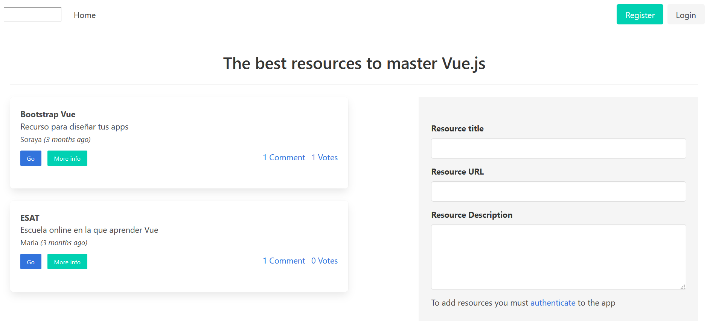
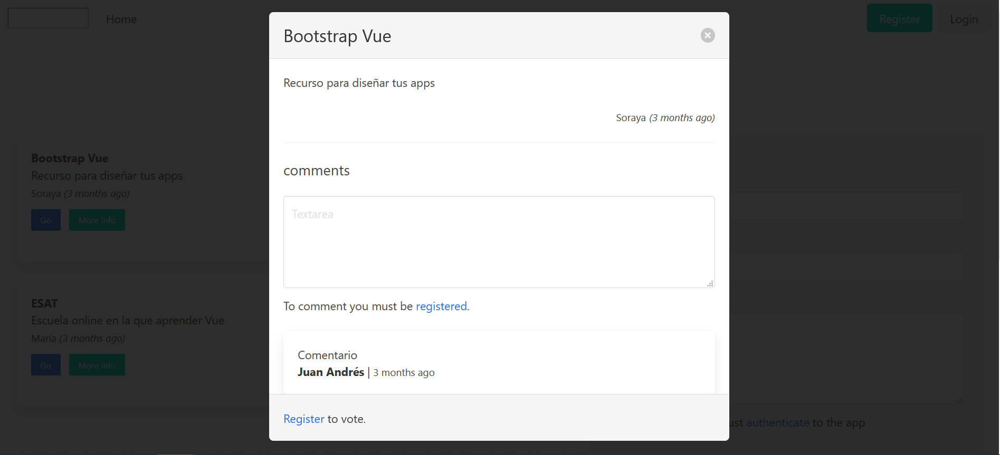
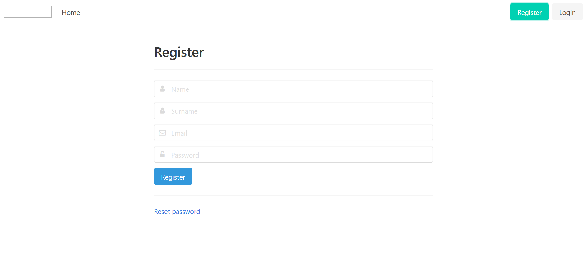

<p align="center"> &nbsp&nbsp&nbsp &nbsp&nbsp&nbsp</p>

# filesvuescollections

Proyecto realizado en el curso [Vue.js profesional en proyectos reales](https://esatonline.es/formacion/vue-js-profesional-en-proyectos-reales/) en la que se realiza un gestor de recursos web.

Está realizado en Vuejs empleando como base de datos Firebase y aplicando estilos mediante Bulma.

Desde la aplicación puedes añadir, ver, editar y elimnar tus recursos. Puedes ver los recursos de otros usuarios, comentarlos y valorarlos. También se establece un ranking de los recursos más votados.

## Configuración y puesta en marcha

### Configuración
```
npm install
```

### Compilar para desarrollo
```
npm run serve
```

### Compilar para producción
```
npm run build
```

### Lints y fixes
```
npm run lint
```
## Capturas

<p></p>

<p></p>

<p></p>

## Despliegue

Puedes ver el despliegue [aquí](https://vuefilos-ebc8b.web.app/)